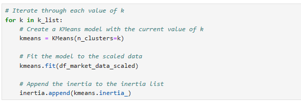
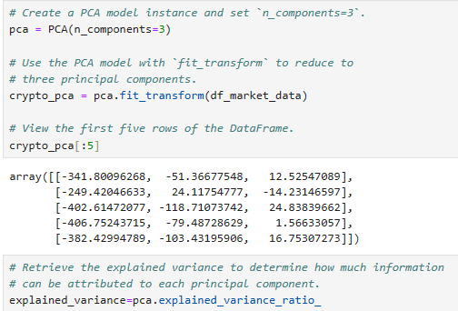
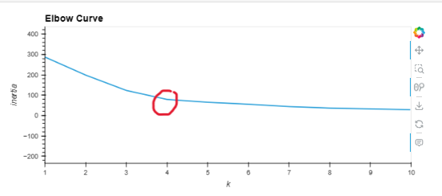
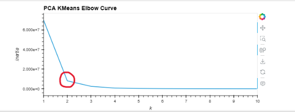
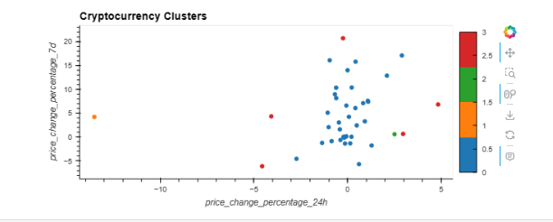

    
# Crypto Market Analysis
    
##### Created by [Demi Oyebanji](mailto:oluwademiladeoyebanji@outlook.com) as an assignment for the **UofT SCS Financial Technology Bootcamp**
________________________________________________________________________________________________________

In this file I compare the performance and viability of offerings on the crypto market including: **bitcoin, ethereum, ripple, chainlink, usd-coin, binance, digibyte and more** using PCA and K-Means analysis. 

I used a crypto_market csv that was provided to me to complete the assessment. 

### Data Processing
* Scaled data for better readable results using StandardScaler
* Renamed columns and resetting the index
* Used a "for" loop to generate the kmeans

### Calculations
* Initialized a K-means calculation using the SKLearn Module
  
  
  
* Initialized a PCA decomposer using SKLearn

  

* Fit both models using preprocessed CSV DAta

### Visualizations

**K-Means Inertia Graph:**

This graph shows me me ideal number of clusters is **k = 4** which just means that having more than four clusters decreases the efficiency of the model. 

**PCA Inertia Graph:**

When I optimize/ simplify the data using Principal Component Analysis(PCA), we can see that the optimal cluster size is now **k = 2**. Which means our simplified data has efficiently reduced the amount of analysis required to model it 

I use the K-Means model to predict which cluster out of the 4 the different crypto assets would be and i plot that below

Then I use the PCS Model to predict the cluster and I plot it as well
.png)

We can see that the PCS Model has substancially less variance in its clusters than the K-Means model.
